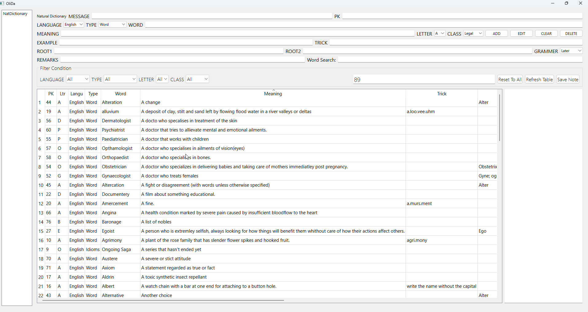

# About:
Welcome to DictionaryMaker!
This application was built for the purposes of helping me build my vocabulary and keep track of hard or unique words. The DictionaryMaker program is built using the PyQt6 GUI library and of course Python with data residing in Sqlite.

* Developed by Olivia Bhowmik
* Email: developer.olivia.bhowmik@gmail.com
* License: MIT
* Version: 1.0.0
* Technology: QtDesigner GUI Tool, Python 3 and Sqlite

# Images:

# Files:
| File Name | Description |
| --------- | ----------- |
| DictionaryMaker.py | Main file that runs the application |
| natdictionary.py | Contains the main dictionary class and required methods |
| dataconnections.py | Helps establish the Sqlite databse connection |
| DictionaryDB.db | Sqlite database file |
| DictionaryMaker.ui | UI file that contains the dictionary GUI, made using QtDesigner |
| Core.ui | Main UI file where sub-applications like the dictionary is added, created so that future add-on modules can be created easily |

# How it Works in a Nutshell:
* DictionaryMaker.py imports all required library and application files and starts the main GUI
* natdictionary.py loads the dictionary GUI with information from the dictionary database
* dataconnections.py establishes a connection with the Sqlite database and creates a cursor for database interactions

# How natdictionary.py Works (Detailed):
* First it imports all required library files
* This file contains the NatDictionary class housing all dictionary functionality (add, edit, delete e.t.c)
* In the first init method, the GUI controls are populated with required data. After that application events (signle click, double click, e.c.t) are connected with handler methods.
* The next several methods (languPopul, typeePopul, lettrPopul, cllasPopul and grammPopul) retrieve respective information from the sqlite database (for example the language of the word etc.) and populates the dropdowns.
* The biggest method, tablePopul, is responsible for populating the main table with word data. It clears away anything previously displayed on the main table, creates headers for every column and reads which filters the user has set. Then it decides what data to display on the main table using two strings called the wherestring and countstring. Through a series of if statements that go through all filter conditions, the program dynamically builds the database retrieval statement to make sure that only the relevant data is retrieved. The method finally sorts the data and resizes the columns to make it more presentable.
* The method clear_button_clicked detects when the user pushes the clear button and deletes any information displayed in the QLineEdit GUI elements at the top of the application window.
* The adda_button_clicked method inserts the information in the QLineEdits into the word database if the Add button is clicked by the user. It calls tablePopul at the end to redisplay the table with the new data included.
* The delt_button_clicked method checks whether the user currently has a pre-existing word selected, and if they do, it removes that word from the database. It calls tablePopul at the end to redisplay data.
* The edit_button_clicked method reads all the text in the different QLineEdit widgets for a currently selected word. It then uses that text to alter the information of the database item selected. It calls tablePopul at the end to redisplay data.
* The cell_single_clicked method detects which word the user clicked on and reads the primary key (pykey) of that word. It then uses the pykey to search a corresponding table (natdictionary_detls) of extra notes. If the word clicked has any extra notes attached, it displays the info on the QTextEdit widget to the side of the main table.
* The cell_double_clicked method identifies which word the user clicked on using the pykey. It reads the information for that word and populates the info on the GUI elements on top.
* The savenote_button_clicked method checks whether a word is selected and if it is, it uploads any extra notes written in the QTextEdit widget to the separate details table.
* Finally the reset_filters_to_all method goes through all the dropdown filters (QComboBoxes) and sets them to the “All” option.

# Installing the Application:
* First make sure to have Python Version 3 installed on your device from https://www.python.org/
* You also need PyQt (application built using PyQt6) that you can load from the command prompt using "pip install PyQt6" (https://www.riverbankcomputing.com/static/Docs/PyQt6/installation.html)
* For admin purposes the user can download the DB Browser for Sqlite and QtDesigner but it isn't necessary to run the program.
* Open the main file "DictionaryMaker.py" through a Python editor and run

# Using the Application:
* In order to select or edit a word the user needs to double click on it
* The rest of the application is fairly self-explanatory

# Future Plans:
Below are some of the ideas I want to implement in the future:
* Implement word search functionality.
* Make the wordcount display how many words are filtered in addition to the total words existing.
* Build a quiz mode that tests the user on the words.
* Implement the ability to connect to external libraries and fetch words
* Provide with an installer so the application can be run independent of the loading of python in a machine